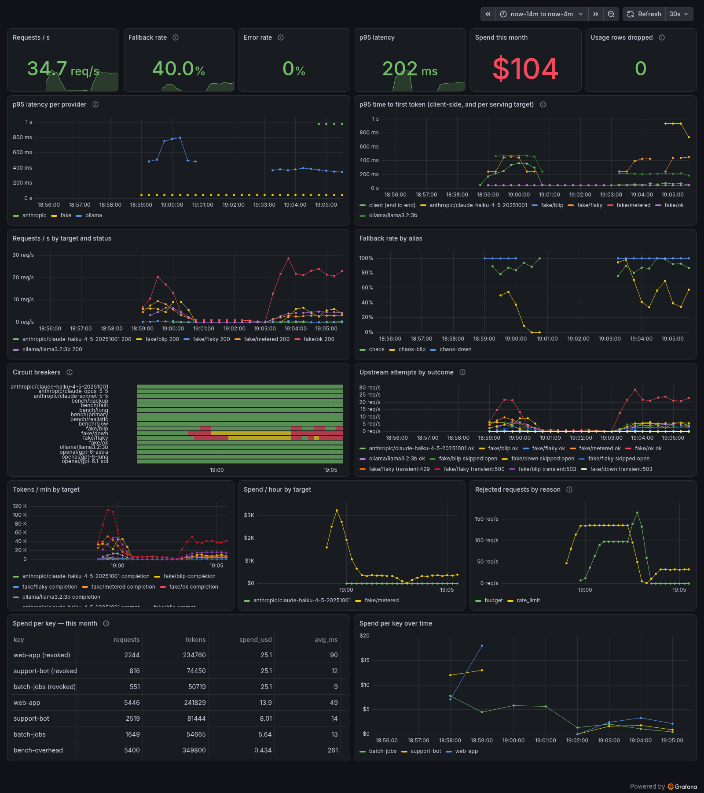
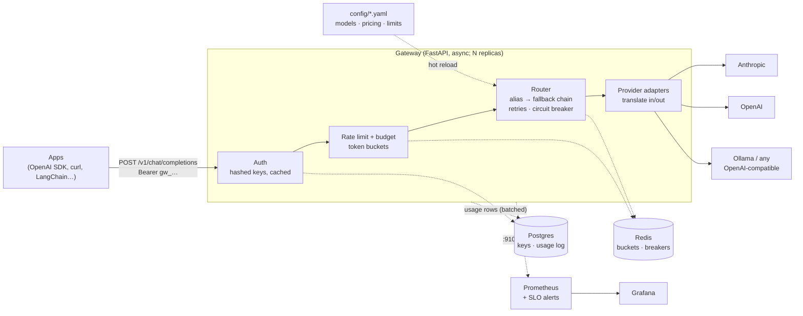

# LLM Gateway

A self-hosted gateway that sits between your applications and LLM providers. Apps talk to
**one endpoint** in the OpenAI request format, which most SDKs and tools already speak. The gateway picks the provider, falls back when one
fails, enforces per-key rate limits and budgets, and records what every request cost.

**"OpenAI-compatible" describes the API the gateway exposes, not the providers behind it.**
Clients use the OpenAI chat-completions format (`/v1/chat/completions`) or the **Anthropic
Messages API** (`/v1/messages`, for the Anthropic SDKs and Claude Code). Internally every
request is converted to one format, which is what lets a request that started on Claude fall
back to another provider. Behind the gateway, requests can go to:

| Provider | How |
|----------|-----|
| **Anthropic Claude** (Opus, Sonnet, Haiku) | Native adapter on the official SDK. It translates messages, tools, streaming, usage and errors both ways. Claude is the first choice in most built-in aliases. |
| **OpenAI** | OpenAI-compatible, with per-model parameter rules |
| **Google Gemini, xAI Grok, Mistral, DeepSeek** | Their OpenAI-compatible APIs, with the parameter rules each one needs ([ADR 0012](docs/decisions/0012-openai-compatible-provider-rules.md)) |
| **Ollama** (local models, free) | Ollama's OpenAI-compatible API |
| **Any OpenAI-compatible API** (vLLM, LM Studio, OpenRouter, Together, …) | Add it in `config/models.yaml`; no code change |

OpenAI, Gemini, xAI, Mistral and DeepSeek are covered by mocked tests but haven't been run
against their live APIs yet. A provider without an API key is skipped.

```python
from openai import OpenAI   # any OpenAI SDK (or LangChain, LlamaIndex, curl, …)

client = OpenAI(base_url="http://localhost:8000/v1", api_key="gw_...")   # a gateway key
resp = client.chat.completions.create(
    model="smart",   # an alias: Claude Opus → Claude Sonnet → OpenAI, in that order
    messages=[{"role": "user", "content": "Hello"}],
    stream=True,
)
for chunk in resp:
    print(chunk.choices[0].delta.content or "", end="")
```

The client never learns which provider answered unless it reads the `x-gateway-provider` header.



<sub>Local demo traffic. The spend figures come from a fake provider priced high on purpose to exercise budgets; they are not real spend.</sub>

## Why

When several apps call LLMs directly, each app repeats the same work and the same failures:

- one provider SDK per app;
- an outage at one provider is an outage for your users;
- no one can say which team spent $4,000 last month;
- a runaway batch job can burn the whole budget.

The gateway moves all of that into one place that the platform team owns:

| | |
|---|---|
| **Routing** | Apps ask for an alias (`fast`, `smart`, `balanced`, `local`, `frontier`). `config/models.yaml` maps each alias to an ordered chain of models. To change models, edit YAML and run `make reload`; apps don't change. |
| **Smart routing** | `model: auto` builds the chain per request: the cheapest, best or fastest model that has what the request needs. Weighted, sticky **A/B variants** test a model or prompt change on part of the traffic ([guide](docs/wiki/Smart-Routing.md)). |
| **Reliability** | Transient errors are retried with jittered backoff, then the next model in the chain is tried. A circuit breaker per model, shared across replicas in Redis, stops traffic to a provider that is down. |
| **Streaming** | SSE relay. Errors before the first token can still fall back. After the first token, errors are reported in-band so a client never gets half of one answer spliced to another. When a client disconnects, the upstream request is cancelled. |
| **Limits** | Every key has requests/min, tokens/min (estimated up front, corrected to actual usage afterwards) and a monthly USD budget. Keys can belong to **teams** with their own budget. Admission is one atomic Redis Lua script, so limits hold across replicas. |
| **Cost** | Each request is priced from `config/pricing.yaml`, including cache read and write rates, long-context tiers and off-peak hours. It's written to a Postgres usage log for per-key and per-team reports. `make prices` checks prices against public catalogs, and a weekly job flags drift for review. |
| **Caching** | An optional response cache per alias, exact or semantic (embeddings + Redis vector sets), scoped per key by default ([guide](docs/wiki/Response-Cache.md)). |
| **Safety and quality** | A prompt-injection filter on user input and tool results (log, flag or block per tier), and LLM-as-judge scoring of a sample of answers ([guide](docs/wiki/Quality-and-Safety.md)). |
| **Self-healing** | Background probes recover providers without spending users' requests. Bad keys and exhausted credit quarantine a provider. Breaker changes go to a Slack-compatible webhook ([guide](docs/wiki/Self-Healing.md)). |
| **Choosing models** | `GET /v1/catalog` gives apps price, capabilities, a quality score and live latency, TTFT and error rate for every model they may use, so they can pick the cheapest or best fit ([guide](docs/wiki/Choosing-Models.md)). |
| **Observability** | Prometheus metrics (never labelled by key), a Grafana dashboard provisioned as code, SLO burn-rate alerts, and JSON logs with a request id. Prompt content is never logged. |

## Documentation

The **[wiki](docs/wiki/Home.md)** explains every part in depth:

- architecture and the life of a request;
- provider translation;
- routing and circuit breakers;
- keys, limits and budgets;
- smart routing, the response cache, guardrails and the judge, self-healing;
- observability, configuration, the API, operations, production deployment and security;
- [a multi-app walkthrough](docs/wiki/Use-Case-Multi-App.md);
- [subscriptions and provider terms](docs/wiki/Subscriptions-and-Terms.md).

What's next is in the **[roadmap](docs/wiki/Roadmap.md)**.

## Use cases

| Situation | What the gateway does |
|-----------|-----------------------|
| **A product feature depends on one LLM provider.** When the provider has an outage or returns 429/529 "overloaded", the feature goes down. | The `smart` / `fast` chains fail over to a second provider, or a local model, before the first token. Users see a slightly different model, not an error. |
| **Several teams share an Anthropic/OpenAI account.** Nobody knows who spent what, and one runaway job can drain the month's budget. | One key per team or service, with its own tokens/min and monthly USD budget. The dashboard and `usage_log` show exact spend per key. A key that hits its budget gets `429 insufficient_quota` instead of a surprise invoice. |
| **A support chatbot or other customer-facing assistant.** Latency and availability matter more than which model answers. | Streaming with time-to-first-token SLOs and burn-rate alerts. Circuit breakers stop sending traffic to a degraded provider within seconds. |
| **Overnight batch jobs** (summarising tickets, tagging documents, evaluations) compete with interactive traffic for the same provider rate limits. | Give the batch key a low tokens/min and its own budget so it can't starve the chatbot. Route it to a cheaper alias such as `fast`. |
| **Moving to a new model**, or comparing a cheaper one. | Change the alias chain in `config/models.yaml` and run `make reload`. Every app moves at once, with no deploys. Per-target latency, error and cost panels show whether the new model is better. |
| **Sensitive or offline workloads, or a dev laptop with no API budget.** | The `local` alias routes to Ollama on your own hardware, so prompts never leave the machine. Ollama also serves as the last fallback in the `fast` and `balanced` chains. |
| **Internal tools built on LangChain, LlamaIndex, the OpenAI SDK or the Anthropic SDK.** | Point `base_url` at the gateway and use a gateway key. Provider API keys stay in one place and never reach app config or laptops. |
| **Developers using Claude Code** on company API keys. |  Point `ANTHROPIC_BASE_URL` at the gateway. Each developer or team gets a key with its own budget, and usage shows up on the same dashboard as everything else. |
| **Security and compliance want an audit trail.** | Every request has a usage row (key, model, tokens, cost, latency, status) and a request id that correlates with logs. Prompt content is never stored. |

## Architecture



Request path: authenticate → reserve rate-limit tokens and budget → resolve the alias →
try each target in the chain (skipping any whose breaker is open) → stream the answer →
reconcile actual tokens and cost → write a usage row in the background.

If Redis or Postgres fails, the gateway degrades instead of going down:

- **Redis down:** rate limits and breakers fail open. Budgets use the last known spend, and spend is queued until Redis is back.
- **Postgres down:** recently used keys are served from cache, keys not in the cache get `503`, and usage rows are dropped and counted.

Chat traffic keeps flowing in both cases. [RESULTS.md](docs/RESULTS.md) has the chaos tests.

## Quickstart

You need Docker with Compose. [Ollama](https://ollama.com) is optional and gives you a free local model.

```bash
git clone https://github.com/AndrewTtofi/llm-gateway.git && cd llm-gateway
cp .env.example .env            # add ANTHROPIC_API_KEY / OPENAI_API_KEY and an admin key
ollama pull llama3.2:3b         # optional: local model, also the last fallback
make up                         # gateway, Redis, Postgres, Prometheus, Grafana
make key name=me tier=dev       # prints a gw_… key once; store it
export GW_KEY=gw_...
```

```bash
curl localhost:8000/v1/chat/completions -H "Authorization: Bearer $GW_KEY" \
  -H 'content-type: application/json' \
  -d '{"model":"fast","messages":[{"role":"user","content":"Say hi in five words"}]}'
```

| Service | URL |
|---------|-----|
| Gateway (API docs at `/docs`) | http://localhost:8000 |
| Grafana (admin / admin) | http://localhost:3000 |
| Prometheus | http://localhost:9090 |

The dev stack binds every port to `127.0.0.1`.

### Watch it fail over (no API keys needed)

The dev stack loads a `fake` provider with failure profiles. Create a key on the `chaos` tier:

```bash
make key name=demo tier=chaos   # → export GW_KEY=gw_…

# chaos-down: the primary always fails. Every request still succeeds.
curl -si localhost:8000/v1/chat/completions -H "Authorization: Bearer $GW_KEY" \
  -H 'content-type: application/json' \
  -d '{"model":"chaos-down","messages":[{"role":"user","content":"hi"}]}' | grep x-gateway
# x-gateway-provider: fake/ok
# x-gateway-fallback: true
# x-gateway-attempts: 1     ← after the first few requests: the breaker has opened,
#                              so the dead primary isn't even tried
```

The primary of `chaos-blip` is down for 20 s of every minute. Keep sending requests and
watch its breaker open, go half-open and close again on the Grafana dashboard. You can
also check breaker state directly:

```bash
curl localhost:8000/admin/providers -H "Authorization: Bearer $GATEWAY_ADMIN_KEY"
```

## Using it

### Aliases

Clients send an alias as `model`. Each alias maps to a chain of models (from `config/models.yaml`):

| Alias | Chain |
|-------|-------|
| `fast` | Claude Haiku 4.5 → OpenAI → Ollama llama3.2 |
| `smart` | Claude Opus 5.5 → Claude Sonnet 5.5 → OpenAI |
| `balanced` | Claude Sonnet 5.5 → OpenAI → Ollama llama3.2 |
| `local` | Ollama llama3.2 |
| `frontier` | The top model from each company: Claude Fable 5.1 → Claude Opus 5.5 → GPT-6 Astra → Gemini 3.1 Pro → Grok 4.7 → Mistral Medium 3.5 → DeepSeek V4.1 Flash |
| `auto` | Chosen per request: the cheapest configured model with quality ≥ 3 that can do what the request needs ([smart routing](docs/wiki/Smart-Routing.md)) |

Clients can also call an exact `provider/model` if their tier allows it. `GET /v1/models`
lists what the key may use.

### Anthropic clients (SDK, Claude Code)

`POST /v1/messages` accepts the Anthropic Messages API. Responses, streaming events and
errors come back in Anthropic's format. Authenticate with `x-api-key` or
`Authorization: Bearer`, using a gateway key.

```python
import anthropic

client = anthropic.Anthropic(base_url="http://localhost:8000", api_key="gw_...")
msg = client.messages.create(
    model="smart", max_tokens=512, messages=[{"role": "user", "content": "Hello"}]
)
```

To route Claude Code through the gateway:

```bash
export ANTHROPIC_BASE_URL=http://localhost:8000
export ANTHROPIC_AUTH_TOKEN=gw_...                 # a gateway key (see the note on tokens/min below)
export ANTHROPIC_MODEL=smart                        # gateway aliases, not Anthropic model IDs
export ANTHROPIC_DEFAULT_HAIKU_MODEL=fast
claude
```

The request is translated into the internal format, so the alias's whole fallback chain
applies, including non-Claude models.

- **Prompt caching and extended thinking** pass through to Claude targets losslessly:
  `cache_control` breakpoints, signed thinking blocks, and streamed thinking.
- **Rejected with a 400:** server tools (web search, code execution) and document blocks.

Claude Code asks for a large `max_tokens` (often 32 000) on every request. The rate limiter
reserves the prompt plus `max_tokens` up front and returns the unused part when the request
finishes, so a Claude Code key needs a tier with a tokens/min well above that, or a per-key
`tokens_per_minute` override.

`/v1/messages/count_tokens` returns the gateway's estimate, not an exact count. Each call counts
as one request against the key's limit.
[ADR 0010](docs/decisions/0010-anthropic-messages-inbound.md) has the details.

### What gets translated for Claude

The Anthropic adapter converts the following, so OpenAI-format clients can use Claude unchanged:

- **Messages:** system messages, multi-turn history, images.
- **Tools:** tool calls and tool results.
- **Parameters:** `tool_choice`, `reasoning_effort` → `effort`, and `stop`.
- **Usage:** reported in OpenAI's shape, including cached prompt tokens.
- **Responses:** finish reasons, plus error types mapped to OpenAI's error shape.

Model capabilities are flags in config rather than code. For example, newer Claude models
reject `temperature`, so the adapter drops it for them. [ADR 0003](docs/decisions/0003-anthropic-adapter.md) has the details.

### Response headers

| Header | Meaning |
|--------|---------|
| `x-gateway-provider` | Which `provider/model` served the request |
| `x-gateway-fallback` | `true` if it wasn't the chain's first choice |
| `x-gateway-attempts` | Upstream calls made, including retries |
| `x-ratelimit-*`, `retry-after` | OpenAI-style rate-limit headers |
| `x-request-id` | The gateway's id for the request, in its logs and usage row (a caller's own id comes back as `x-client-request-id`) |
| `server-timing: admit;dur=…` | Time the gateway spent on auth and limits |

Errors use OpenAI's shape (`{"error": {"message", "type", "code"}}`):

- **Over a rate limit:** `429 rate_limit_exceeded` with `retry-after`.
- **Too many requests in flight for the key:** `429 concurrency_limit_exceeded`.
- **Budget used up:** `429 insufficient_quota`.

### API keys and limits

Keys look like `gw_…`. They are shown once and stored only as a SHA-256 hash. Each key has
a tier from `config/limits.yaml`:

| Tier | Requests/min | Tokens/min | Budget/month | In flight | Aliases |
|------|-------------|-----------|--------------|-----------|---------|
| `dev` | 60 | 50 000 | $10 | 10 | `fast`, `local` |
| `standard` | 300 | 200 000 | $100 | 50 | `fast`, `balanced`, `smart`, `local`, `frontier`, `auto` |

Usage the provider bills is billed to the key too: reasoning output, and a request cut off
by a hang-up or a timeout, for at least the time the provider worked on it
([ADR 0023](docs/decisions/0023-security-hardening.md)).

Limits, budget and allowed aliases can be overridden per key:

```bash
curl -X POST localhost:8000/admin/keys -H "Authorization: Bearer $GATEWAY_ADMIN_KEY" \
  -H 'content-type: application/json' \
  -d '{"name":"batch-job","tier":"standard","tokens_per_minute":50000,"monthly_budget_usd":20}'
curl localhost:8000/admin/keys -H "Authorization: Bearer $GATEWAY_ADMIN_KEY"     # keys + spend
curl -X DELETE localhost:8000/admin/keys/<id> -H "Authorization: Bearer $GATEWAY_ADMIN_KEY"
```

### Changing models

All models, aliases, chains and prices live in `config/`. The application code contains no model names:

```yaml
# config/models.yaml
aliases:
  support-bot:   # a new alias: apps send model="support-bot"
    chain: [anthropic/claude-sonnet-5-5, openai/<model>, ollama/llama3.2:3b]
```

Run `make reload` and the change applies without a restart. [docs/CHANGING-MODELS.md](docs/CHANGING-MODELS.md)
covers adding a provider, a model or a price.

| File | Purpose |
|------|---------|
| `.env` | Secrets and service URLs (see `.env.example`) |
| `config/models.yaml` | Providers, models, capability flags, aliases, timeouts, retry and breaker settings |
| `config/pricing.yaml` | $ per 1M input / output / cached tokens per model (`make prices` to check) |
| `config/catalog.yaml` | Context window, capabilities and your quality score per model |
| `config/limits.yaml` | Rate limits, budgets and allowed aliases per tier |

## Observability

Grafana provisions the **LLM Gateway** dashboard at startup (pictured above). It shows:

- request and error rates, fallback rate by alias, and p95 latency per provider;
- time to first token, both end to end and per target;
- a circuit-breaker timeline;
- upstream attempts by outcome;
- tokens and spend per target;
- rejections by reason;
- spend per key.

The dashboard is code: edit `config/grafana/build_dashboard.py`, run it, and commit both.

- **Metrics:** `gateway_*` on an internal port (`:9100/metrics`). Labels come from bounded sets (alias, target, status, outcome, reason, …), never the API key.
- **Usage log:** the `usage_log` table has one row per request: key, alias, target, tokens, cost, latency, TTFT, attempts and status.
- **Logs:** JSON lines with `request_id`. They record prompt length, never content.
- **SLOs:** `config/prometheus-rules.yml` has multi-window burn-rate alerts on the availability error budget and a p95 TTFT alert. It also alerts on an open breaker, dropped usage rows, event-loop lag and the gateway being down.

## Results

These numbers come from one laptop and a mock provider. The mock replays measured Claude
Haiku timing. Runs are paired request by request, so the mock's own randomness cancels out.
[docs/RESULTS.md](docs/RESULTS.md) has the method, charts and raw numbers.

| | |
|---|---|
| Gateway overhead | **+2.8 ms p50 / +4.0 ms p95** per request · **+3.9 ms (0.7%)** on a realistic time to first token |
| With a 100k-character prompt | **+6.8 ms p50 / +8.2 ms p95** (estimate and injection scan included) |
| Concurrent streams, one replica (one core) | Within 10% of a direct connection up to **100** streams; at **200**, +54 ms at p95 as the core saturates |
| Throughput, 1 → 2 replicas | **417 → 551 req/s** (the test rig tops out at 899) |
| Rate-limit accuracy across 2 replicas | **−0.12%** of the configured limit |
| Budget overshoot, 50 concurrent streams | **+0.9%** (≈0.8 requests) |
| Provider outage | **3** requests went to the dead provider before the breaker opened · **0** errors reached clients |
| Provider down/slow, Redis slow/down, Postgres down | **100%** of requests served in each case (while Redis is down, rate limits are off and budgets use the last known spend; while Postgres is down, uncached keys get `503`) |
| SIGTERM with open streams | **97/97** streams completed |

Measured on the full request path: guardrails, cache lookup and atomic budget holds. That
path is about 0.2 ms heavier than v1.0's, after profiling won back most of what v1.3 had
added (4 Redis round trips per request, no timer per streamed chunk).

To reproduce:

```bash
docker compose -f docker-compose.yml -f docker-compose.bench.yml up -d --build
python tests/load/run_bench.py
python tests/load/report.py
```

## Deploying

The gateway is a stateless container. Release images for amd64 and arm64 are published to
`ghcr.io/andrewttofi/llm-gateway` on every `v*` tag, with an SBOM and signed provenance.

**On one host:** `docker-compose.prod.yml` runs the whole stack:
- Caddy with automatic TLS, with operator endpoints kept off the public site;
- two hardened gateway replicas;
- a migration job and Redis + Postgres;
- daily `usage_log` retention;
- optional Prometheus and Grafana, using a read-only database role.

```bash
cp .env.prod.example .env.prod   # fill in secrets (openssl rand -hex 32)
docker compose -f docker-compose.prod.yml --env-file .env.prod up -d
```

See [Production deployment](docs/wiki/Production-Deployment.md). Anywhere else, run as many
replicas as you need behind a load balancer, with managed Redis and Postgres:

- **Health checks:**
  - `/healthz` is the liveness check.
  - `/readyz` returns `503` until startup finishes and `200` after. It reads a status that a background task refreshes every 5 s, so a probe never waits on a hung database.
  - The `/readyz` body reports Redis and Postgres status, but their failures don't make it fail. Every replica shares those dependencies, so failing readiness would pull all replicas at once, while the gateway can serve without them.
- **Migrations:** the image's default command runs `alembic upgrade head` and then starts the server, which is fine for a single instance. With several replicas, run migrations once per deploy as a job, and start replicas with `uvicorn app.main:app --host 0.0.0.0 --port 8000 --timeout-graceful-shutdown 30`. `docker-compose.bench.yml` shows this setup.
- **Load balancer:** streams can run for minutes. Set idle and request timeouts above `stream_total` in `models.yaml`, and turn off response buffering for `text/event-stream`.
- **Shutdown:** on `SIGTERM`, uvicorn waits up to `--timeout-graceful-shutdown` for open streams to finish. Give the orchestrator a longer termination grace period than that.
- **Network:** keep `:9100/metrics`, `/admin/*` and ideally `/readyz` (its body names your dependencies) reachable only from inside your network and the load balancer. Pass secrets as environment variables from your secret store.

## FAQ

**Does it work with a ChatGPT Plus or Claude Pro/Max subscription?** No, and that's by design.
The [subscriptions page](docs/wiki/Subscriptions-and-Terms.md) has the per-provider details and sources.
Those subscriptions cover the consumer apps (chatgpt.com, claude.ai, the Claude desktop and
mobile apps, and Claude Code signed in with your account). They don't come with API
credentials, and the providers' terms don't allow their login tokens to be reused to serve
other applications. The gateway uses **API keys**, which are billed per token from the
provider console (console.anthropic.com, platform.openai.com). That billing model is why
per-key budgets and cost tracking matter. A self-hosted model through Ollama costs nothing per
token. The gateway can, however, give *your* users subscription-like plans: tiers in
`config/limits.yaml` (rate limits, monthly budget, allowed models) work as plans, and each key
is a subscriber.

**Can Claude Code or the Anthropic SDK point at it?** Yes, through `/v1/messages` (see
[Anthropic clients](#anthropic-clients-sdk-claude-code)). The gateway key replaces the
Anthropic API key, and requests are billed to the provider API keys configured in the
gateway, not to a subscription.

**Is it only for chat?** Yes: `/v1/chat/completions` and `/v1/messages` (both with tools,
images and streaming), plus `/v1/models` and `/v1/catalog`. Behind the scenes the gateway
uses OpenAI's Responses API where a model requires it, and embedding models for the
semantic cache. There are no public embeddings, image-generation or audio endpoints.

## Design decisions

Each non-obvious choice has an ADR in [docs/decisions/](docs/decisions/):

| ADR | Decision |
|-----|----------|
| [0001](docs/decisions/0001-config-driven-models.md) | All models are defined in config, not code |
| [0002](docs/decisions/0002-streaming-errors-and-disconnects.md) | Streaming error semantics and client disconnects |
| [0003](docs/decisions/0003-anthropic-adapter.md) | Anthropic adapter: official SDK, capabilities as config |
| [0004](docs/decisions/0004-retries-fallback-circuit-breaker.md) | Retries, fallback chains and circuit breakers |
| [0005](docs/decisions/0005-mid-stream-failure-policy.md) | No fallback after the first token |
| [0006](docs/decisions/0006-api-keys.md) | Gateway API keys: hashed, cached, stale-if-error |
| [0007](docs/decisions/0007-rate-limits-and-budgets.md) | Token-aware rate limits and budgets: estimate, then reconcile |
| [0008](docs/decisions/0008-observability.md) | Usage log, metrics with bounded labels, logs without prompts |
| [0009](docs/decisions/0009-benchmarking.md) | How the gateway is benchmarked |
| [0010](docs/decisions/0010-anthropic-messages-inbound.md) | Inbound Anthropic Messages API, translated at the edge |
| [0011](docs/decisions/0011-model-catalog-and-pricing-sync.md) | Model catalog, and price sync with review |
| [0012](docs/decisions/0012-openai-compatible-provider-rules.md) | Per-provider parameter rules for OpenAI-compatible APIs, and the `frontier` alias |
| [0013](docs/decisions/0013-lossless-anthropic-features.md) | Prompt caching and extended thinking through `/v1/messages` |
| [0014](docs/decisions/0014-openai-responses-api.md) | OpenAI Responses API adapter |
| [0015](docs/decisions/0015-cost-accuracy.md) | Long-context tiers, cache-write prices and off-peak pricing |
| [0016](docs/decisions/0016-teams-key-edits-production.md) | Teams, key edits, body limits and production packaging |
| [0017](docs/decisions/0017-policy-routing.md) | Policy routing (`model: auto`) |
| [0018](docs/decisions/0018-response-cache.md) | Response cache, exact and semantic |
| [0019](docs/decisions/0019-self-healing-alerts.md) | Self-healing: background probes, quarantine, alerts |
| [0020](docs/decisions/0020-ab-routing.md) | A/B routing with weighted, sticky variants |
| [0021](docs/decisions/0021-prompt-injection-filter.md) | Prompt-injection filter |
| [0022](docs/decisions/0022-llm-as-judge.md) | LLM-as-judge sampling |
| [0023](docs/decisions/0023-security-hardening.md) | Security hardening after the audit: billing, shared breakers, bounded requests |
| [0024](docs/decisions/0024-operational-readiness.md) | Operational readiness: alert routing, runbooks, backups, budget alerts |
| [0025](docs/decisions/0025-security-finish.md) | Pre-deploy security: image and dependency scanning, operator keys, audit log, networks |

## Development

```bash
make install     # dev dependencies from the hashed lockfile
make test        # unit + integration tests; providers are mocked, so nothing costs money
make test-live   # also hits real providers (costs money)
make lint        # ruff + mypy
make lock        # re-pin after editing requirements*.in (ARGS=--upgrade to bump)
```

The stack is Python 3.14 · FastAPI · httpx · Anthropic SDK · Redis 8 · Postgres 18
(SQLAlchemy async + Alembic) · Prometheus · Grafana. Dependabot opens weekly update PRs.

The repo is set up for [Claude Code](https://claude.com/claude-code): see `CLAUDE.md`,
`.claude/agents/` and `.claude/skills/`.

## Contributing and security

See [CONTRIBUTING.md](CONTRIBUTING.md). Report vulnerabilities privately as described in
[SECURITY.md](SECURITY.md).

A full security audit (October 2026) found no auth bypass, injection, SSRF or secret leak.
Its billing, availability and hardening findings are fixed and tested
(`tests/test_hardening.py`). [Security](docs/wiki/Security.md#security-audit-october-2026) has
the summary.

## License

[MIT](LICENSE)
