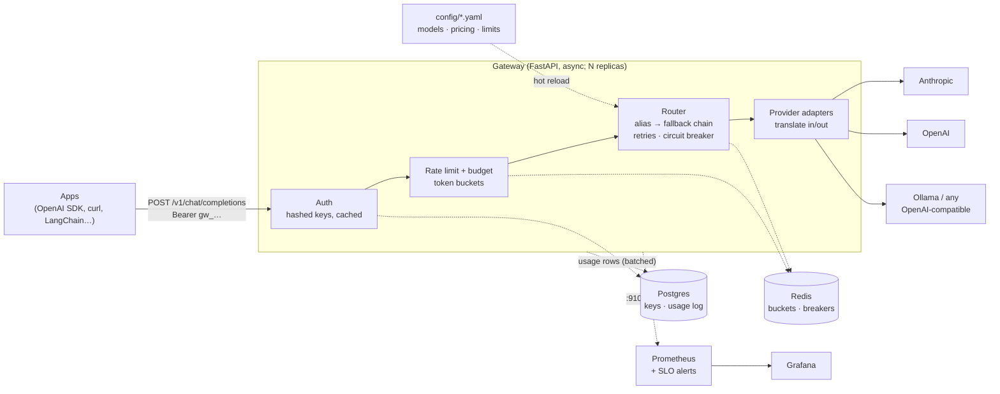

# LLM Gateway

A self-hosted gateway that sits between your applications and LLM providers. Apps talk to
**one endpoint with one API format**. The gateway picks the provider, falls back when one
fails, enforces per-key rate limits and budgets, and records what every request cost.

**"OpenAI-compatible" describes the API the gateway exposes, not the providers behind it.**
Clients use the OpenAI chat-completions format, which most SDKs and tools already speak.
Behind the gateway, requests can go to:

| Provider | How |
|----------|-----|
| **Anthropic Claude** (Opus, Sonnet, Haiku) | Native adapter on the official SDK. It translates messages, tools, streaming, usage and errors both ways. Claude is the first choice in most built-in aliases. |
| **OpenAI** | Passthrough |
| **Ollama** (local models, free) | Ollama's OpenAI-compatible API |
| **Any OpenAI-compatible API** (vLLM, LM Studio, OpenRouter, Together, …) | Add it in `config/models.yaml`; no code change |

```python
from openai import OpenAI   # any OpenAI SDK (or LangChain, LlamaIndex, curl, …)

client = OpenAI(base_url="http://localhost:8000/v1", api_key="gw_...")   # a gateway key
resp = client.chat.completions.create(
    model="smart",   # an alias: Claude Opus → Claude Sonnet → OpenAI, in that order
    messages=[{"role": "user", "content": "Hello"}],
    stream=True,
)
for chunk in resp:
    print(chunk.choices[0].delta.content or "", end="")
```

The client never learns which provider answered unless it reads the `x-gateway-provider` header.


## Why

When several apps call LLMs directly, each app repeats the same work and the same failures:

- one provider SDK per app;
- an outage at one provider is an outage for your users;
- no one can say which team spent $4,000 last month;
- a runaway batch job can burn the whole budget.

The gateway moves all of that into one place that the platform team owns:

| | |
|---|---|
| **Routing** | Apps ask for an alias (`fast`, `smart`, `balanced`, `local`). `config/models.yaml` maps each alias to an ordered chain of models. To change models, edit YAML and run `make reload`; apps don't change. |
| **Reliability** | Transient errors are retried with jittered backoff, then the next model in the chain is tried. A circuit breaker per model, shared across replicas in Redis, stops traffic to a provider that is down. |
| **Streaming** | SSE relay. Errors before the first token can still fall back. After the first token, errors are reported in-band so a client never gets half of one answer spliced to another. When a client disconnects, the upstream request is cancelled. |
| **Limits** | Every key has requests/min, tokens/min (estimated up front, corrected to actual usage afterwards) and a monthly USD budget. Limits are enforced across replicas with one Redis Lua script per request. |
| **Cost** | Each request is priced from `config/pricing.yaml`, including cached-token rates, and written to a Postgres usage log for per-key reports. |
| **Observability** | Prometheus metrics (never labelled by key), a Grafana dashboard provisioned as code, SLO burn-rate alerts, and JSON logs with a request id. Prompt content is never logged. |

## Architecture



Request path: authenticate → reserve rate-limit tokens and budget → resolve the alias →
try each target in the chain (skipping any whose breaker is open) → stream the answer →
reconcile actual tokens and cost → write a usage row in the background.

If Redis or Postgres fails, the gateway degrades instead of going down:

- **Redis down:** limits and breakers fail open.
- **Postgres down:** cached keys are served stale, and usage rows are dropped and counted.

Chat traffic keeps flowing in both cases. [RESULTS.md](docs/RESULTS.md) has the chaos tests.

## Quickstart

You need Docker with Compose. [Ollama](https://ollama.com) is optional and gives you a free local model.

```bash
git clone https://github.com/AndrewTtofi/llm-gateway.git && cd llm-gateway
cp .env.example .env            # add ANTHROPIC_API_KEY / OPENAI_API_KEY and an admin key
ollama pull llama3.2:3b         # optional: local model, also the last fallback
make up                         # gateway, Redis, Postgres, Prometheus, Grafana
make key name=me tier=dev       # prints a gw_… key once; store it
export GW_KEY=gw_...
```

```bash
curl localhost:8000/v1/chat/completions -H "Authorization: Bearer $GW_KEY" \
  -H 'content-type: application/json' \
  -d '{"model":"fast","messages":[{"role":"user","content":"Say hi in five words"}]}'
```

| Service | URL |
|---------|-----|
| Gateway (API docs at `/docs`) | http://localhost:8000 |
| Grafana (admin / admin) | http://localhost:3000 |
| Prometheus | http://localhost:9090 |

The dev stack binds every port to `127.0.0.1`.

### Watch it fail over (no API keys needed)

The dev stack loads a `fake` provider with failure profiles. Create a key on the `chaos` tier:

```bash
make key name=demo tier=chaos   # → export GW_KEY=gw_…

# chaos-down: the primary always fails. Every request still succeeds.
curl -si localhost:8000/v1/chat/completions -H "Authorization: Bearer $GW_KEY" \
  -H 'content-type: application/json' \
  -d '{"model":"chaos-down","messages":[{"role":"user","content":"hi"}]}' | grep x-gateway
# x-gateway-provider: fake/ok
# x-gateway-fallback: true
# x-gateway-attempts: 1     ← the breaker is open, so the dead primary isn't even tried
```

The primary of `chaos-blip` is down for 20 s of every minute. Keep sending requests and
watch its breaker open, go half-open and close again on the Grafana dashboard. You can
also check breaker state directly:

```bash
curl localhost:8000/admin/providers -H "Authorization: Bearer $GATEWAY_ADMIN_KEY"
```

## Using it

### Aliases

Clients send an alias as `model`. Each alias maps to a chain of models (from `config/models.yaml`):

| Alias | Chain |
|-------|-------|
| `fast` | Claude Haiku 4.5 → OpenAI → Ollama llama3.2 |
| `smart` | Claude Opus 5.5 → Claude Sonnet 5.5 → OpenAI |
| `balanced` | Claude Sonnet 5.5 → OpenAI → Ollama llama3.2 |
| `local` | Ollama llama3.2 |

Clients can also call an exact `provider/model` if their tier allows it. `GET /v1/models`
lists what the key may use.

### What gets translated for Claude

The Anthropic adapter converts the following, so OpenAI-format clients can use Claude unchanged:

- **Messages:** system messages, multi-turn history, images.
- **Tools:** tool calls and tool results.
- **Parameters:** `tool_choice`, `reasoning_effort` → `effort`, and `stop`.
- **Usage:** reported in OpenAI's shape, including cached prompt tokens.
- **Responses:** finish reasons, plus error types mapped to OpenAI's error shape.

Model capabilities are flags in config rather than code. For example, newer Claude models
reject `temperature`, so the adapter drops it for them. [ADR 0003](docs/decisions/0003-anthropic-adapter.md) has the details.

### Response headers

| Header | Meaning |
|--------|---------|
| `x-gateway-provider` | Which `provider/model` served the request |
| `x-gateway-fallback` | `true` if it wasn't the chain's first choice |
| `x-gateway-attempts` | Upstream calls made, including retries |
| `x-ratelimit-*`, `retry-after` | OpenAI-style rate-limit headers |
| `x-request-id` | Correlates with the gateway's logs and usage row |
| `server-timing: admit;dur=…` | Time the gateway spent on auth and limits |

Errors use OpenAI's shape (`{"error": {"message", "type", "code"}}`):

- **Over a rate limit:** `429 rate_limit_exceeded` with `retry-after`.
- **Budget used up:** `429 insufficient_quota`.

### API keys and limits

Keys look like `gw_…`. They are shown once and stored only as a SHA-256 hash. Each key has
a tier from `config/limits.yaml`:

| Tier | Requests/min | Tokens/min | Budget/month | Aliases |
|------|-------------|-----------|--------------|---------|
| `dev` | 60 | 50 000 | $10 | `fast`, `local` |
| `standard` | 300 | 200 000 | $100 | `fast`, `balanced`, `smart`, `local` |

Any field can be overridden per key:

```bash
curl -X POST localhost:8000/admin/keys -H "Authorization: Bearer $GATEWAY_ADMIN_KEY" \
  -H 'content-type: application/json' \
  -d '{"name":"batch-job","tier":"standard","tokens_per_minute":50000,"monthly_budget_usd":20}'
curl localhost:8000/admin/keys -H "Authorization: Bearer $GATEWAY_ADMIN_KEY"     # keys + spend
curl -X DELETE localhost:8000/admin/keys/<id> -H "Authorization: Bearer $GATEWAY_ADMIN_KEY"
```

### Changing models

All models, aliases, chains and prices live in `config/`. The application code contains no model names:

```yaml
# config/models.yaml
aliases:
  smart:
    chain: [anthropic/claude-opus-5-5, openai/<model>, ollama/llama3.2:3b]
```

Run `make reload` and the change applies without a restart. [docs/CHANGING-MODELS.md](docs/CHANGING-MODELS.md)
covers adding a provider, a model or a price.

| File | Purpose |
|------|---------|
| `.env` | Secrets and service URLs (see `.env.example`) |
| `config/models.yaml` | Providers, models, capability flags, aliases, timeouts, retry and breaker settings |
| `config/pricing.yaml` | $ per 1M input / output / cached tokens per model |
| `config/limits.yaml` | Rate limits, budgets and allowed aliases per tier |

## Observability

Grafana provisions the **LLM Gateway** dashboard at startup (pictured above). It shows:

- request and error rates, fallback rate by alias, and p95 latency per provider;
- time to first token, both end to end and per target;
- a circuit-breaker timeline;
- upstream attempts by outcome;
- tokens and spend per target;
- rejections by reason;
- spend per key.

The dashboard is code: edit `config/grafana/build_dashboard.py`, run it, and commit both.

- **Metrics:** `gateway_*` on an internal port (`:9100/metrics`), labelled by alias, target and status only.
- **Usage log:** the `usage_log` table has one row per request: key, alias, target, tokens, cost, latency, TTFT, attempts and status.
- **Logs:** JSON lines with `request_id`. They record prompt length, never content.
- **SLOs:** `config/prometheus-rules.yml` has multi-window burn-rate alerts on the availability error budget and a p95 TTFT alert. It also alerts on an open breaker, dropped usage rows, event-loop lag and the gateway being down.

## Results

These numbers come from one laptop and a mock provider. The mock replays measured Claude
Haiku timing. Runs are paired request by request, so the mock's own randomness cancels out.
[docs/RESULTS.md](docs/RESULTS.md) has the method, charts and raw numbers.

| | |
|---|---|
| Gateway overhead | **+2.6 ms p50 / +3.8 ms p95** per request · **+4.2 ms (0.8%)** on a realistic time to first token |
| Concurrent streams, one replica (one core) | Within 10% of a direct connection up to **200** streams; the core saturates at **400** |
| Throughput, 1 → 2 replicas | **445 → 614 req/s** (the test rig tops out at 951) |
| Rate-limit accuracy across 2 replicas | **−0.06%** of the configured limit |
| Budget overshoot, 50 concurrent streams | **+3.4%** (≈2.8 requests) |
| Provider outage | **5** requests went to the dead provider before the breaker opened · **0** errors reached clients |
| Provider down/slow, Redis slow/down, Postgres down | **100%** of requests served in each case (while Redis is down, limits are off) |
| SIGTERM with open streams | **90/90** streams completed |

To reproduce:

```bash
docker compose -f docker-compose.yml -f docker-compose.bench.yml up -d --build
python tests/load/run_bench.py
python tests/load/report.py
```

## Deploying

The gateway is a stateless container (`Dockerfile`). Run as many replicas as you need
behind a load balancer, with managed Redis and Postgres.

- **Health checks:**
  - `/healthz` is the liveness check.
  - `/readyz` returns `503` until startup finishes and `200` after.
  - The `/readyz` body reports Redis and Postgres status, but their failures don't make it fail. Every replica shares those dependencies, so failing readiness would pull all replicas at once, while the gateway can serve without them.
- **Migrations:** the image's default command runs `alembic upgrade head` and then starts the server, which is fine for a single instance. With several replicas, run migrations once per deploy as a job, and start replicas with `uvicorn app.main:app --host 0.0.0.0 --port 8000 --timeout-graceful-shutdown 30`. `docker-compose.bench.yml` shows this setup.
- **Load balancer:** streams can run for minutes. Set idle and request timeouts above `stream_total` in `models.yaml`, and turn off response buffering for `text/event-stream`.
- **Shutdown:** on `SIGTERM`, uvicorn waits up to `--timeout-graceful-shutdown` for open streams to finish. Give the orchestrator a longer termination grace period than that.
- **Network:** keep `:9100/metrics` and `/admin/*` internal. Pass secrets as environment variables from your secret store.

## Design decisions

Each non-obvious choice has an ADR in [docs/decisions/](docs/decisions/):

| ADR | Decision |
|-----|----------|
| [0001](docs/decisions/0001-config-driven-models.md) | All models are defined in config, not code |
| [0002](docs/decisions/0002-streaming-errors-and-disconnects.md) | Streaming error semantics and client disconnects |
| [0003](docs/decisions/0003-anthropic-adapter.md) | Anthropic adapter: official SDK, capabilities as config |
| [0004](docs/decisions/0004-retries-fallback-circuit-breaker.md) | Retries, fallback chains and circuit breakers |
| [0005](docs/decisions/0005-mid-stream-failure-policy.md) | No fallback after the first token |
| [0006](docs/decisions/0006-api-keys.md) | Gateway API keys: hashed, cached, stale-if-error |
| [0007](docs/decisions/0007-rate-limits-and-budgets.md) | Token-aware rate limits and budgets: estimate, then reconcile |
| [0008](docs/decisions/0008-observability.md) | Usage log, metrics with bounded labels, logs without prompts |
| [0009](docs/decisions/0009-benchmarking.md) | How the gateway is benchmarked |

## Development

```bash
make install     # dev dependencies from the hashed lockfile
make test        # unit + integration tests; providers are mocked, so nothing costs money
make test-live   # also hits real providers (costs money)
make lint        # ruff + mypy
make lock        # re-pin after editing requirements*.in (ARGS=--upgrade to bump)
```

The stack is Python 3.14 · FastAPI · httpx · Anthropic SDK · Redis 8 · Postgres 18
(SQLAlchemy async + Alembic) · Prometheus · Grafana. Dependabot opens weekly update PRs.

The repo is set up for [Claude Code](https://claude.com/claude-code): see `CLAUDE.md`,
`.claude/agents/` and `.claude/skills/`.

## Contributing and security

See [CONTRIBUTING.md](CONTRIBUTING.md). Report vulnerabilities privately as described in
[SECURITY.md](SECURITY.md).

## License

[MIT](LICENSE)
