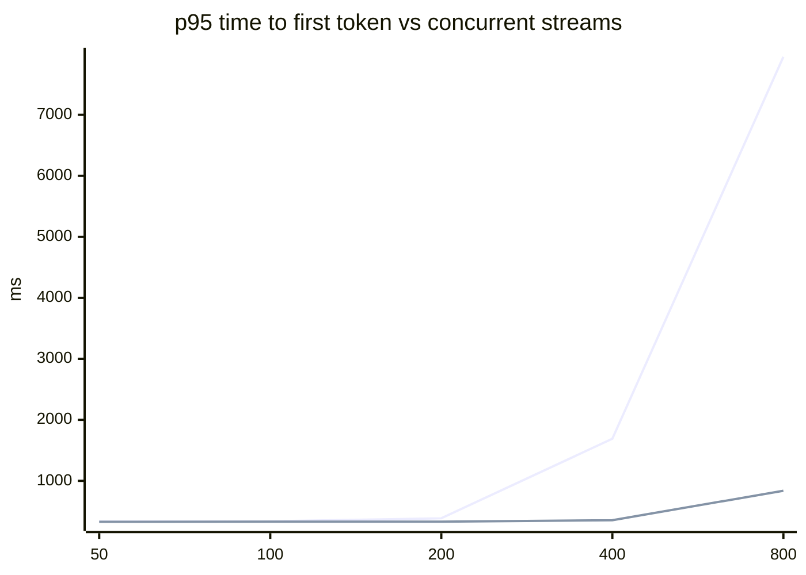

# Results

Phase 6: how much the gateway costs, how far it scales, and what happens when things break. Method: [ADR 0009](decisions/0009-benchmarking.md). Reproduce:

```bash
docker compose -f docker-compose.yml -f docker-compose.bench.yml up -d --build
python tests/load/run_bench.py      # ~40 min → tests/load/results/
python tests/load/report.py         # → this file
```

## Key findings

- **Overhead:** +2.79 ms p50 / +4.02 ms p95 per request at 100 req/s (paired); +3.90 ms to a realistic time-to-first-token. Tail under 100 streams/s: +4.22 ms at p95.
- **Capacity:** one replica (one core) stays within 10% of the direct path up to 100 concurrent streams.
- **Accuracy:** rate limit across 2 replicas -0.12%; budget overshoot +0.9% with 50 concurrent streams; usage log 1598/1598 rows.
- **Breaker:** 3 requests paid for the dead primary before it opened; 0 client-visible errors.
- **Chaos:** provider down/slow, Redis slow/down, Postgres down — 100.0%+ of requests served in each. Redis outages switch rate limits off (fail open; budgets use the last known spend, and spend is queued); a slow provider costs 2 × first_token per request until the breaker opens.
- **Operations:** 97/97 streams open at SIGTERM completed; config reloads under load caused 0 errors.
- **SLO alerts:** GatewayErrorBudgetFastBurn fired during a full outage.

## 1. Gateway overhead

The same requests go once **directly** to the mock provider and once **through the gateway** (auth, model check, budget, two token buckets, routing, breaker, metering, usage log). Runs are **paired by seed**: request *i* gets identical provider delays on both paths, so the mock's randomness cancels and the per-request difference is the gateway alone. Open-loop load, latency measured from each request's scheduled start.

| Load | Direct p50 / p95 | Gateway p50 / p95 | **Added by the gateway** (paired p50 / p95) | Admission p50 |
|---|---|---|---|---|
| non-stream, whole request, 20 req/s | 1.69 ms / 2.35 ms | 5.19 ms / 6.13 ms | **+3.53 ms / +4.73 ms** | 1.32 ms |
| non-stream, whole request, 100 req/s | 2.03 ms / 3.06 ms | 4.89 ms / 5.60 ms | **+2.79 ms / +4.02 ms** | 1.20 ms |
| stream, time to first token, 20 req/s | 2.59 ms / 3.36 ms | 6.13 ms / 7.64 ms | **+3.54 ms / +5.21 ms** | 1.24 ms |
| stream, time to first token, 100 req/s | 2.44 ms / 3.04 ms | 5.76 ms / 6.47 ms | **+3.32 ms / +4.22 ms** | 1.16 ms |
| non-stream, whole request, **100k-character prompt**, 20 req/s | 2.04 ms / 2.71 ms | 8.89 ms / 10.0 ms | **+6.84 ms / +8.18 ms** | 4.59 ms |
| stream, time to first token, **100k-character prompt**, 20 req/s | 2.98 ms / 3.76 ms | 9.84 ms / 11.1 ms | **+6.86 ms / +8.18 ms** | 4.55 ms |

**With realistic provider timing** — the mock samples TTFT and inter-chunk gaps from 60 real Claude Haiku 4.5 streams (TTFT p50 540 ms, gap p50 24.8 ms), 20 req/s:

| | Direct p50 | Gateway p50 | Added (paired p50 / p95) |
|---|---|---|---|
| Time to first token | 538 ms | 542 ms | +3.90 ms / +5.89 ms |
| Whole stream | 1.7 s | 1.8 s | +3.80 ms / +9.56 ms |

So against a real model's first token the gateway adds **0.7%** at p50.

**Where it goes:** about a third is admission (the `server-timing` header: auth, model check, budget, rate limits); the rest is the extra network hop, routing and relaying. The gateway makes 4 Redis round trips per request (2 more for priced models). Under 100 streams/s the paired p95 is +4.22 ms — the tail is what a production deployment would watch first.

## 2. Capacity — concurrent streams on one replica

Closed loop: N clients each holding a ~5 s stream (≈300 ms to first token, then 200 chunks ≈25 ms apart, ±10% jitter), client starts spread over one stream length. Each step also runs **directly** against the mock with the same load: the load generator and the mock are single Python processes too, and where *direct* degrades the rig is the limit, not the gateway.

| Streams | TTFT p95 direct → gateway (added) | Chunk gap p95 direct → gateway | Success | Event-loop lag | Gateway CPU peak | Memory |
|---|---|---|---|---|---|---|
| 50 | 328 ms → 335 ms (+6.95 ms) | 27.4 ms → 27.4 ms | 100.0% | 0.04 ms | 33% | 126MiB |
| 100 | 330 ms → 335 ms (+5.23 ms) | 27.3 ms → 27.3 ms | 100.0% | 0.04 ms | 54% | 133.9MiB |
| 200 | 332 ms → 386 ms (+54.2 ms) | 27.4 ms → 27.5 ms | 100.0% | 0.72 ms | 96% | 148.3MiB |
| 400 | 354 ms → 1.7 s (+1.3 s) | 28.5 ms → 45.5 ms | 100.0% | 18.5 ms | 101% | 164.6MiB |
| 800 | 837 ms → 8.0 s (+7.1 s) | 62.6 ms → 45.1 ms | 100.0% | 22.2 ms | 100% | 168.7MiB |


_line 1: through the gateway (ms) · line 2: direct (ms)_

**Reading it:** Through **100** concurrent streams the gateway stays within 10% of the direct path (TTFT and chunk gaps). At 200 it adds +54.2 ms to p95 TTFT. At 200 its single core is the bottleneck (CPU 96%, event loop 0.72 ms late). Memory stays modest (126MiB → 168.7MiB). Scale out with replicas beyond the first core.

## 3. Horizontal scaling — 1 vs 2 replicas

Closed loop, 200 clients, non-streaming requests to an instant mock, 5 s warm-up, runs alternating 1 → 2 → rig → 1 → 2 → rig. Both replicas share Redis (buckets, breakers, budgets) and Postgres. *Rig ceiling* = the same load straight to the mock, no gateway.

| Path | Run | Requests/s | p50 | p95 | Success |
|---|---|---|---|---|---|
| 1 replica | run 1 | 403.9 | 376 ms | 1.2 s | 100.0% |
| 1 replica | run 2 | 416.8 | 367 ms | 1.2 s | 100.0% |
| 2 replicas | run 1 | 468.6 | 259 ms | 1.1 s | 100.0% |
| 2 replicas | run 2 | 550.9 | 221 ms | 927 ms | 100.0% |
| no gateway (rig ceiling) | run 1 | 898.9 | 154 ms | 639 ms | 100.0% |
| no gateway (rig ceiling) | run 2 | 893.3 | 156 ms | 648 ms | 100.0% |

Best: **1 replica 417 req/s · 2 replicas 551 req/s · rig ceiling 899 req/s.** Two replicas serve 1.32× one replica's throughput, below the rig's ceiling. What it does show: two replicas sharing Redis and Postgres serve the load without errors, and limits stay exact across them (section 4).

## 4. Accuracy

| What | Result |
|---|---|
| Rate limit across **2 replicas** (1200 req/min, 20 s, 100 clients) | 1598 allowed vs 1600 expected → **-0.12%** (8360 rejected) |
| Budget under concurrency ($0.05, 50 concurrent streams, 2 replicas) | spent $0.05046 → **+0.9%** (≈0.8 requests' worth; 83 served, 12521 blocked) |
| Usage log completeness | 1598 rows for 1598 admitted requests |
| Token estimate ÷ actual (p50) | bench-fast (max_tokens 128): **2.43×**; bench-realistic (max_tokens 200): **1.66×** |

The mock honours `max_tokens` like a real provider, so the estimate is exact on output and pessimistic only by what's left unused (estimates reserve the whole `max_tokens`, then reconcile). The budget overshoot is the race the budget check allows by design (ADR 0007): requests admitted while others are still in flight — the check reads month-to-date spend, then reserves, without a lock.

## 5. Circuit breaker

`bench-ha` = [primary, backup] at 50 req/s. The primary fails at t=16 s and recovers at t=41 s (breaker: 5 failures to open, 30 s open, then one probe).

| | |
|---|---|
| Requests that failed for the client | **0** of 4500 |
| Requests that paid for a failed attempt before the breaker opened | **3** (6 failed attempts) |
| Primary back in service after it recovered | 5.03 s — anywhere from 0 to 30 s by design (the next probe after `open_seconds`); here it depends on when the outage ended |

Detection is counted in requests, not seconds: the breaker opens after 5 failed attempts, so at a low request rate it takes longer in wall-clock time.


_line 1: primary · line 2: backup_

## 6. Chaos

| Scenario | Served | p50 | p95 | What happened |
|---|---|---|---|---|
| Provider down (primary 503s, backup available) | 100.0% | 16.1 ms | 17.1 ms | Fallback hides it; once the breaker opens, no request pays for the dead primary. |
| Provider slow (sends no token within `first_token` = 5 s; streams) | 100.0% | 18.4 ms | 10.1 s | Until the breaker opens, each request waits out the timeout **twice** (2 attempts × 5 s; p50 10.1 s in the first 5 s), then goes straight to the backup (p50 18.2 ms later). Non-streaming requests have no first-token budget and would wait up to `total`. |
| Rate-limit storm — the flooding key (300 req/s, limit 60/min) | 20 / 6000 | 2.45 ms | 3.03 ms | 5980 rejected with 429, 20 served. |
| Rate-limit storm — another key at the same time | 100.0% | 5.96 ms | 7.34 ms | Unaffected. |
| Redis +200 ms latency | 100.0% | 3.56 ms | 108 ms | Redis calls time out (100 ms); limits and breakers **fail open** for 5 s at a time. Traffic flows; spend is queued on each replica and written once Redis answers, and budgets use the last known spend meanwhile (ADR 0023). |
| Redis down | 100.0% | 3.29 ms | 4.59 ms | Fails open: rate limits and breakers are off until it's back. Budgets keep the last known spend plus what each replica queued, so a spent key stays blocked. |
| Postgres down | 100.0% | 6.55 ms | 8.28 ms | A key idle past its 30 s cache TTL keeps working via stale-if-error (1000 requests authenticated that way); an unknown key gets 503; 1000 usage rows dropped and counted. |

## 7. Operations

| Scenario | Result |
|---|---|
| SIGTERM with open streams (`--timeout-graceful-shutdown 30`) | **97 of 97** streams that were open at SIGTERM completed; restart took 7.2 s |
| Config reload every ~0.25 s under 50 req/s of streams | 66 reloads, 0 failed; requests 100.0% successful |

## 8. SLO alerts

`config/prometheus-rules.yml`: two SLOs — 99.9% of admitted requests succeed; p95 time to first token (as the client sees it) ≤ 1.5 s — with multi-window burn-rate alerts (SRE workbook), plus health alerts. Validated with `promtool`. Then both bench providers failed for ~3.5 minutes at 30 req/s across both replicas:

| Alert | Severity | State reached | After |
|---|---|---|---|
| GatewayErrorBudgetSlowBurn | ticket | pending | 50 s |
| GatewayErrorBudgetFastBurn | page | firing | 170 s |

Already active before the fault (carried over from earlier scenarios), so not counted: GatewayAuthServedStale, GatewayCircuitOpen, GatewayRedisFailingOpen, GatewayTTFTSLOBreach, GatewayUsageLogDropping.

The page-level fast burn needs both the 5-minute and 1-hour error ratios above 14.4× the budget rate and then `for: 2m`, so it fires a few minutes in. With both breakers open, requests fail fast (503 `all_providers_unavailable`) instead of piling up behind dead providers.

## Environment and limits

- One laptop: Linux 6.6.87.1-microsoft-standard-WSL2 (WSL2), 16 CPUs, Mem:              30           5           2           0          22          24 GB RAM, Docker Desktop. Load generator, 2 gateway replicas, Redis, Postgres, Toxiproxy and the mock share it.
- Gateway: one uvicorn process per replica, no `--reload`; Redis and Postgres reached through Toxiproxy (one extra hop). Load generator inside the Docker network.
- Realistic timing: 60 real Claude Haiku 4.5 streams (2807 inter-chunk gaps), measured through the gateway (so they include its few ms).
- Absolute numbers are a floor for this hardware; the comparisons — direct vs gateway, before vs during a fault — are what transfer.
- Generated 2026-10-06 09:16 UTC by `tests/load/report.py`.
