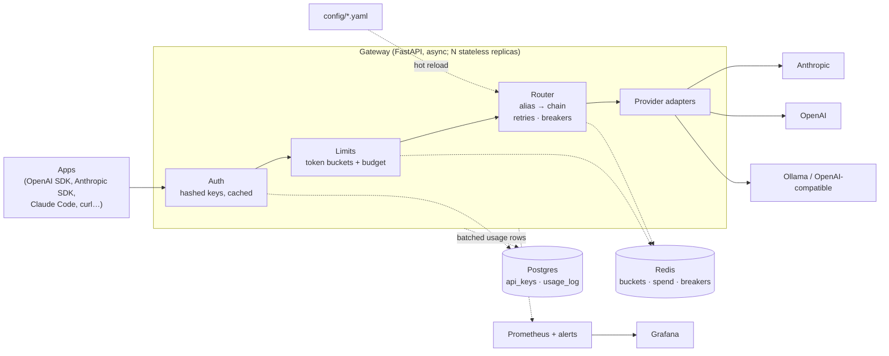

# Architecture

## Components



| Component | Where | Role |
|-----------|-------|------|
| FastAPI app | `app/main.py` | Routes, the chat pipeline, error handlers, admin API |
| Inbound Anthropic format | `app/messages_api.py` | `/v1/messages` translation in and out |
| Auth | `app/auth/` | Key format check, hashing, a cache in front of Postgres |
| Rate limits and spend | `app/ratelimit/` | Token buckets and month-to-date spend in Redis (Lua) |
| Router | `app/routing/router.py` | Failure classification, retries, fallback |
| Circuit breaker | `app/routing/breaker.py` | Per-target state machine in Redis (or memory) |
| Adapters | `app/providers/` | `openai_compat.py` (httpx), `anthropic.py` + `anthropic_format.py` (official SDK), `fake.py` (chaos) |
| Streaming | `app/streaming.py` | SSE relay, disconnect handling, wire formats |
| Metering | `app/metering.py` | Reconciles tokens and cost, writes the usage record |
| Observability | `app/observability/` | Prometheus metrics, JSON logs, the usage-log writer |
| Process-wide stores | `app/services.py` | Picks the Redis/Postgres or in-memory implementations at startup; readiness checks |
| Config | `app/config.py`, `config/*.yaml` | Settings from env, plus the model registry, pricing and limits from YAML |
| Policy and A/B routing | `app/routing/policy.py`, `app/routing/ab.py` | Chains chosen per request ([Smart routing](Smart-Routing.md)) |
| Self-healing | `app/routing/selfheal.py` | Background probes, quarantine, alerts ([Self-healing](Self-Healing.md)) |
| Response cache | `app/cache.py` | Exact and semantic answer cache ([Response cache](Response-Cache.md)) |
| Guardrails, judge | `app/guardrails.py`, `app/judge.py` | Prompt-injection filter; background answer scoring ([Quality and safety](Quality-and-Safety.md)) |
| Extensions | `app/extensions.py` | Anthropic-only fields (caching, thinking) carried through the internal format |
| Responses API | `app/providers/openai_responses.py` | Chat completions ↔ OpenAI Responses API |

## Life of a request

```mermaid
sequenceDiagram
    participant C as Client
    participant G as Gateway
    participant R as Redis
    participant P as Provider
    participant DB as Postgres

    C->>G: POST /v1/chat/completions (Bearer gw_…)
    G->>G: key format check, SHA-256, cache lookup
    G-->>DB: (cache miss) look up key
    G->>R: month-to-date spend < budget?
    G->>R: take 1 request + estimated tokens (one Lua script)
    G->>R: reserve the estimated cost
    G->>G: resolve alias → chain; skip targets whose breaker is open
    G->>P: call target 1 (retry transient errors with backoff)
    P--xG: 529 overloaded
    G->>P: call target 2 (fallback)
    P-->>G: first chunk
    G-->>C: 200 + headers, then stream chunks
    P-->>G: … last chunk + usage
    G-->>C: [DONE]
    G->>R: reconcile tokens; replace the reserved cost with the real cost
    G-->>DB: usage row (background batch)
```

1. **Authenticate.** The key must look like `gw_` plus 43 characters, so garbage is
   rejected without a database query. It's hashed, then looked up in an in-process cache
   (30 s TTL, coalesced lookups), then in Postgres.
2. **Authorise.** The key's tier must allow the requested alias or `provider/model`.
3. **Budget.** Month-to-date spend must be under the key's monthly budget.
4. **Rate limits.** One atomic Redis script charges both buckets (requests/min and
   tokens/min) with the estimate.
5. **Reserve cost.** The estimated cost, priced at the chain's first target, is held
   against the budget so concurrent requests can't all spend the last dollar.
6. **Choose and check.** In order:
   - The prompt-injection filter runs (per the tier's action).
   - An A/B alias picks the arm.
   - A cached alias may answer straight away.
   - A policy alias builds this request's chain.
7. **Route.** Walk the chain. For each target whose breaker allows it, call it, retry
   transient failures, and fall back on failures that aren't the client's fault.
8. **Stream or return.** For streams, the first chunk is fetched *before* the 200 goes
   out, so everything up to then can still fail over.
9. **Settle.**
   - Replace the token estimate with real usage, and the reserved cost with the real cost
     of the target that actually served.
   - Record metrics.
   - Queue a usage row; store the answer in the cache, and hand a sample to the judge, if enabled.
   - Settling runs even if the client disconnects or the server is shutting down.

## Where state lives

| State | Store | Why there |
|-------|-------|-----------|
| API keys | Postgres `api_keys` | Durable and queryable; hashed only |
| Usage history | Postgres `usage_log` | One row per request, for exact per-key reports |
| Token buckets, spend | Redis | Shared by every replica and updated atomically on the hot path |
| Circuit breakers | Redis | One replica's failures should protect all of them |
| Key cache | In-process | Keeps Postgres off the hot path; 30 s revocation lag |
| Config | YAML on disk, in memory | Reloaded on `/admin/reload` or `SIGHUP` |

The gateway process itself is **stateless**. Any replica can serve any request, and
replicas can be added or removed freely.

## Degraded modes

The design favours availability: a gateway that is down takes every AI feature down with it.

| Failure | Behaviour | Trade-off |
|---------|-----------|-----------|
| Redis down | Rate limits and breakers **fail open**. Budgets use each replica's last known spend; spend is queued and written when Redis is back. Redis calls are skipped for 5 s after an error, so requests don't each wait on a timeout | Rate limits aren't enforced until Redis returns (`GatewayRedisFailingOpen` pages) |
| Postgres down | Recently seen keys keep working from cache (stale-if-error, up to 10 min). Usage rows are dropped and counted (`gateway_usage_log_dropped_total`) | Unknown keys get 503 `auth_unavailable`; some usage history is lost |
| One provider down | Its breaker opens and traffic goes to the next target | Answers come from a different model |
| All targets down | 503 `all_providers_unavailable`, retryable | — |
| Prometheus down | Nothing changes for clients | Gaps in graphs |

`/readyz` reports these dependencies but doesn't fail on them. That's deliberate; see
[Operations and deployment](Operations-and-Deployment.md#health-checks).

## Concurrency model

Everything on the request path is `async`: FastAPI on uvicorn, `httpx`/`httpx2` clients with
per-provider connection pools, `redis.asyncio`, and SQLAlchemy async with asyncpg.

- **No blocking calls.** One blocked call would stall every in-flight stream on that
  process. `gateway_event_loop_lag_seconds` measures how late a 0.5 s timer fires, so a
  stall shows up immediately.
- **Disconnects cancel upstream work.** If the client hangs up while the gateway waits for
  the provider, a watcher task cancels the upstream call. `SSEResponse` always closes the
  upstream stream, so a provider can't keep generating, and billing, tokens nobody will read.
- **Graceful shutdown.** On `SIGTERM`, uvicorn stops accepting new connections and waits up
  to `--timeout-graceful-shutdown` (30 s in the image) for open streams.
