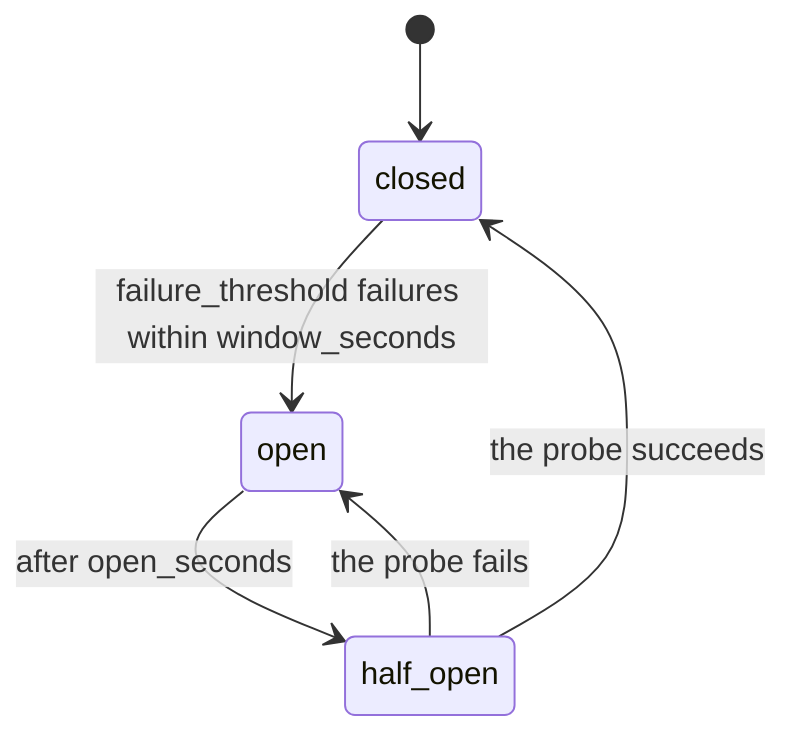

# Routing and reliability

ADRs: 0002 (streaming errors), 0004 (retries, fallback, breakers), 0005 (mid-stream failures),
0023 (what doesn't count against a breaker).

## Resolving a model

1. If `model` is an alias, use its chain.
2. Otherwise, if `allow_direct_models` is on and `model` is a known `provider/model` (from
   an alias chain or a provider's `models` list), use it alone.
3. Anything else is a 404 `model_not_found`. Arbitrary names would each create breaker
   state, which an attacker could make unbounded.

## Failure classification

Every failure is classified first (`app/routing/router.py::classify`):

| Failure | Retry same target | Fall back | Counts against breaker |
|---|---|---|---|
| Client fault: 400/413/422, untranslatable request | no | no; returned to the client | no |
| Gateway fault: 401/403/404 upstream, quota exhausted, missing provider key | no | yes | yes |
| Provider type not supported or not configured | n/a | yes | no (never called) |
| Transient: `retry_on_status` (408/409/429/5xx/529), connect failures, first-token and idle timeouts | yes, with backoff | yes, after retries | yes |
| The whole answer ran past `total` (non-streamed) or `stream_total` | no | yes | **no** |
| No free connection in the pool (`pool` timeout): `skipped:busy` | no | yes | **no** (never sent) |
| Untranslatable for *this* provider only (e.g. `n>1` on Anthropic) | no | yes | no |

**Why some timeouts don't count (ADR 0023).** The breakers are shared by every tenant on every
replica, so only failures the *provider* caused may open them:
- **A full pool** means this replica is busy; the request was never sent. If nothing else in
  the chain can serve, the client gets a retryable `503 gateway_busy`.
- **A request past `total`/`stream_total`** took as long as it was asked to. A huge
  `max_tokens` or a high reasoning effort makes a healthy provider slow. Counting it would
  let one tenant open the breaker for all. It isn't retried on the same target either: it
  would take as long again. It is still billed (the provider did the work).

Connect failures, first-token timeouts and stalled streams still count. A sick provider
shows up there.

Why gateway faults become 5xx for the client: if the gateway's OpenAI key is revoked, the
client did nothing wrong. Returning 401 would make it "fix" a request that was fine.

## Retries

Up to `retry.max_attempts_per_provider` attempts per target (default 2), with **exponential
backoff and full jitter**: sleep `random(0, min(backoff_max_ms, backoff_base_ms × 2ⁿ))`.

Full jitter matters during an outage. If 1 000 clients fail at the same moment and all
retry after exactly 250 ms, they hit the recovering provider together. Jitter spreads them out.

A provider's `retry-after` is honoured (plus up to 10% jitter) if it's within
`backoff_max_ms`. A longer one skips straight to the next target, because waiting 60 s
while another provider is available helps nobody.

## Fallback

When a target fails (and isn't a client fault), the next target in the chain is tried. The
response says who served it:

- `x-gateway-provider`: the `provider/model` that answered;
- `x-gateway-fallback: true` when it wasn't the first choice;
- `x-gateway-attempts`: upstream calls actually made.

If nothing works, the error returned is ranked:

1. the last real provider failure;
2. otherwise, "this provider can't express the request";
3. if targets were only skipped because their breakers were open, a retryable 503
   `all_providers_unavailable`, never a 400 for a request that would succeed later.

**Cost of a stalled provider.** A provider that accepts the connection but never sends the
first token costs `attempts × first_token` seconds before fallback, because timeouts are
retried. With the defaults that's 2 × 30 s. Tune `first_token` per provider. Interactive
aliases want it short.

## Circuit breakers

One breaker per **target** (`provider/model`), not per provider. Anthropic signals overload
per model (529), and a busy Opus shouldn't push Haiku traffic away.

- **Closed:** traffic flows, and failures are counted in a sliding window.
- **Open:** the target is skipped and costs no time.
- **Half-open:** exactly one **probe** request is let through, using an atomic `SET NX` with
  a unique token.
  - Only the probe's result changes the state. Requests that started before the trip can't
    close or extend it.
  - A probe that ends without a verdict (the client hung up) releases its slot.
  - A client-fault answer counts as success, because the provider did respond.
  - `probe_timeout_seconds` must exceed the slowest possible call. Otherwise a slow but
    healthy probe lets a second probe through.
- **Shared state:** the state lives in Redis, so every replica shares it. Lua scripts make
  "count the failure and maybe open" atomic across replicas, and the keys use hash tags so
  this works on Redis Cluster.
- **Redis down:** the breaker fails open and skips Redis for 5 s.
- **Measured:** 5 requests went to a dead provider before the breaker opened, and 0 errors
  reached clients ([Testing and benchmarks](Testing-and-Benchmarks.md)).

Check state with `GET /admin/providers` or the Grafana "Circuit breakers" panel
(`gateway_circuit_state`: 0 closed, 1 half-open, 2 open).

## Timeouts

Configured per provider in `models.yaml`. LLM calls need more than one timeout:

| Timeout | Guards against |
|---------|----------------|
| `connect` | An unreachable host |
| `first_token` | A provider that accepts the request but never starts answering. Long prompts take time to process, so don't set it too low |
| `stream_idle` | Silence between stream events. Reasoning models can pause for a long time, so Anthropic uses 300 s |
| `stream_total` | A stream that never ends, such as a provider sending keep-alives forever |
| `total` | A non-streaming call, where the whole answer arrives at once |
| `pool` | Waiting for a free connection when the provider's pool is exhausted (never counted against the provider) |

Toward the client, a streaming write that doesn't complete in `CLIENT_WRITE_TIMEOUT_SECONDS`
(30 s) disconnects it. A client that stops reading can't hold an upstream connection open.
Keys also have a limit on requests in flight
([Keys, limits and budgets](Keys-Limits-and-Budgets.md#concurrency-requests-in-flight)).

## The first-token boundary

This is the central rule for streams (ADR 0005):

- **Before the first chunk:** everything can be retried or fall back. The gateway pulls the
  first chunk from the provider *before* sending `200 OK` to the client, so a provider that
  fails immediately is invisible to the client.
- **After the first chunk:** the gateway is committed to that target. A failure is sent
  in-band and the stream ends **without** its end marker:
  - **OpenAI format:** `data: {"error": {...}}`, then no `data: [DONE]`. The OpenAI SDK
    raises `APIError`.
  - **Anthropic format:** `event: error`, then no `message_stop`.

The missing end marker matters, because a client must never mistake a truncated answer for
a complete one. Two alternatives were rejected:

- **Continue on another model** by sending it the partial answer as a prefill. Current Claude
  models reject prefill, the join shows mid-sentence, tool-call arguments can't be spliced
  safely, and the partial answer is billed twice.
- **Restart from the beginning.** The client has already shown the first tokens, so they
  would appear twice.

The breaker still counts the failure, so the *next* request goes elsewhere if the target
keeps failing.

## Disconnects

- **Before the first chunk:** if the client hangs up while waiting, the upstream call is
  cancelled. Waiting for the first chunk is the longest wait, because it includes prompt
  processing.
- **During a stream:** `SSEResponse` closes the upstream stream itself, so the provider
  stops generating tokens nobody will read.
- **Billing:** hanging up isn't free. The provider has already processed the prompt, so the
  estimated prompt tokens are charged. A stream cut mid-way is charged for what was relayed.
